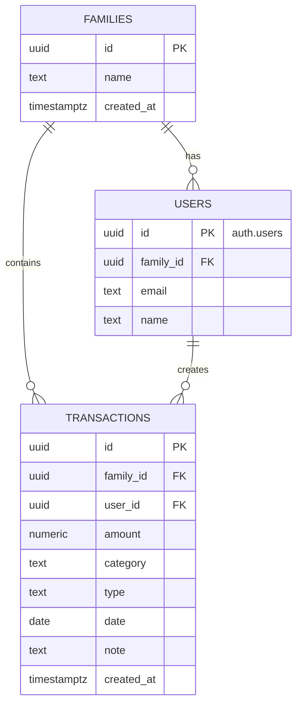

# 資料庫設計文件 (Database Schema)

基於 `git-worktree-spec.md` 的需求，以下是 Supabase 的資料庫結構、欄位說明以及用於快速搭建的 SQL 腳本。

---

## 🏗️ 資料庫結構 (ER Schema)



> **💡 補充說明**：為達成 RLS「確保只有同一個 Family ID 的人能看到該筆資料」的需求，我在 `users` 表格中補上了 `family_id` 關聯欄位，以利系統能透過登入使用者的 `auth.uid()` 找出對應的家族，並作為存取權限的判斷依據。

---

## 📋 表格與欄位說明

### 1. `families` (家族/群組表)
用於記錄共同記帳的家庭或群組。
| 欄位名稱 | 型別 | 屬性 | 說明 |
| --- | --- | --- | --- |
| `id` | `uuid` | PK, Default `uuid_generate_v4()` | 家族唯一識別碼 |
| `name` | `text` | Not Null | 家族名稱 |
| `created_at` | `timestamptz` | Default `now()` | 建立時間 |

### 2. `users` (使用者表)
對應 Supabase 原生 `auth.users` 表的公開使用者資訊。
| 欄位名稱 | 型別 | 屬性 | 說明 |
| --- | --- | --- | --- |
| `id` | `uuid` | PK, FK 關聯 `auth.users.id` | 使用者唯一識別碼 (綁定 Auth) |
| `family_id` | `uuid` | FK 關聯 `families.id`, Nullable | 所屬家族 ID (支援未加入家族狀態) |
| `email` | `text` | Not Null | 註冊信箱 |
| `name` | `text` | Nullable | 顯示名稱/暱稱 |

### 3. `transactions` (交易紀錄表)
記錄所有收支明細。
| 欄位名稱 | 型別 | 屬性 | 說明 |
| --- | --- | --- | --- |
| `id` | `uuid` | PK, Default `uuid_generate_v4()` | 交易唯一識別碼 |
| `family_id` | `uuid` | FK 關聯 `families.id` | 該筆交易隸屬的家族 |
| `user_id` | `uuid` | FK 關聯 `users.id` | 建立此交易的使用者 |
| `amount` | `numeric(12,2)`| Not Null | 金額 |
| `category` | `text` | Not Null | 記帳分類 (如: 飲食、交通、薪資) |
| `type` | `text` | Not Null | 交易類型 (如: income, expense) |
| `date` | `date` | Not Null | 發生日期 |
| `note` | `text` | Nullable | 備註說明 |
| `created_at` | `timestamptz` | Default `now()` | 紀錄建立時間 (預設系統時間) |

---

## ⚡ 快速搭建 SQL 語法 (含 RLS 安全規則)

請將以下 SQL 複製到 Supabase 的 **SQL Editor** 中執行。

```sql
-- 啟用 UUID 擴充功能
CREATE EXTENSION IF NOT EXISTS "uuid-ossp";

-- ==========================================
-- 1. 建立 Tables
-- ==========================================

-- 建立 Families 表格
CREATE TABLE families (
  id uuid PRIMARY KEY DEFAULT uuid_generate_v4(),
  name text NOT NULL,
  created_at timestamptz DEFAULT now()
);

-- 建立 Users 表格 (關聯 auth.users)
CREATE TABLE users (
  id uuid PRIMARY KEY REFERENCES auth.users(id) ON DELETE CASCADE,
  family_id uuid REFERENCES families(id) ON DELETE SET NULL,
  email text NOT NULL,
  name text
);

-- 建立 Transactions 表格
CREATE TABLE transactions (
  id uuid PRIMARY KEY DEFAULT uuid_generate_v4(),
  family_id uuid REFERENCES families(id) ON DELETE CASCADE,
  user_id uuid REFERENCES users(id) ON DELETE CASCADE,
  amount numeric(12,2) NOT NULL,
  category text NOT NULL,
  type text NOT NULL CHECK (type IN ('income', 'expense', 'transfer')),
  date date NOT NULL,
  note text,
  created_at timestamptz DEFAULT now()
);

-- ==========================================
-- 2. 啟用 Row Level Security (RLS)
-- ==========================================

ALTER TABLE families ENABLE ROW LEVEL SECURITY;
ALTER TABLE users ENABLE ROW LEVEL SECURITY;
ALTER TABLE transactions ENABLE ROW LEVEL SECURITY;

-- ==========================================
-- 3. 設定 RLS 政策 (Policies)
-- ==========================================

-- ------------------------------------------
-- Users 的 RLS 政策
-- ------------------------------------------
-- 1. 使用者能讀取自己的資料，或與自己同家族成員的資料
CREATE POLICY "Users can view their own and family members profile" ON users
  FOR SELECT USING (
    id = auth.uid() OR 
    family_id IN (SELECT family_id FROM users WHERE id = auth.uid())
  );

-- 2. 使用者只能修改自己的資料
CREATE POLICY "Users can update their own profile" ON users
  FOR UPDATE USING (id = auth.uid());

-- ------------------------------------------
-- Families 的 RLS 政策
-- ------------------------------------------
-- 1. 使用者只能看見自己所屬的家族資訊
CREATE POLICY "Users can view their own family" ON families
  FOR SELECT USING (
    id IN (SELECT family_id FROM users WHERE id = auth.uid())
  );

-- ------------------------------------------
-- Transactions 的 RLS 政策
-- ------------------------------------------
-- 1. 讀取：使用者只能讀取與自己同家族的交易紀錄
CREATE POLICY "Users can view family transactions" ON transactions
  FOR SELECT USING (
    family_id IN (SELECT family_id FROM users WHERE id = auth.uid())
  );

-- 2. 新增：使用者只能新增掛在自己家族底下的紀錄
CREATE POLICY "Users can insert family transactions" ON transactions
  FOR INSERT WITH CHECK (
    family_id IN (SELECT family_id FROM users WHERE id = auth.uid()) 
    AND user_id = auth.uid()
  );

-- 3. 修改：使用者只能修改掛在自己家族底下的紀錄
CREATE POLICY "Users can update family transactions" ON transactions
  FOR UPDATE USING (
    family_id IN (SELECT family_id FROM users WHERE id = auth.uid())
  );

-- 4. 刪除：使用者只能刪除掛在自己家族底下的紀錄
CREATE POLICY "Users can delete family transactions" ON transactions
  FOR DELETE USING (
    family_id IN (SELECT family_id FROM users WHERE id = auth.uid())
  );
```
